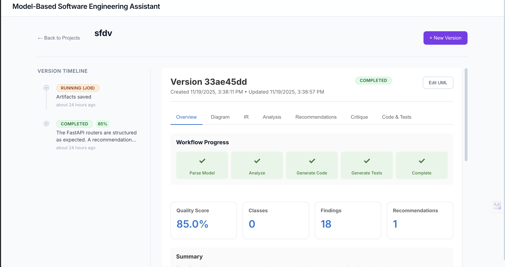

Model-Based Software Engineering Assistant (MBSE Assistant)
=========================================================

A compact multi-agent system that converts UML/PlantUML diagrams into refactored code, tests, and analysis reports. The workflow is designed for clarity and easy extension.

Overview

Quick start
# Screenshot



...existing code...
Model-Based Software Engineering Assistant

This repository provides a multi-agent system that turns UML/PlantUML diagrams into refactored code, tests, and architectural guidance.

Overview
--------
[[Diagram of the architecture and workflow]](images/workflow.png)
This project uses a LangGraph workflow with multiple agents to:

- parse UML (PlantUML) into an intermediate representation (IR)
- analyze the model for SOLID and design-pattern-based issues
- generate refactored code (Python) with interfaces and dependency injection
- generate tests (pytest) and run them in a sandbox
- attempt to self-correct syntax/import errors
- produce a critique report that includes issues, recommendations, and detected patterns

Key components
--------------

- backend: FastAPI server and multi-agent orchestration
- codegen: code generation and refactoring agent
- testgen: automated test generation agent
- parser: PlantUML to JSON IR converter
- analysis: deterministic detectors + LLM-RAG for context-aware suggestions

Quick start
-----------

Prerequisites
- Python 3.12+
- Node.js for the UI
- Optional: Google Gemini/OpenAI keys for LLMs

Install

```bash
git clone https://github.com/yourusername/model-based-se-assistant.git
cd model-based-se-assistant
python -m venv ag
source ag/bin/activate
pip install -r requirements.txt
cp .env.example .env
# Edit .env to add LLM keys if you have them
```

Run backend + UI
-----------------

```bash
# Terminal 1 - Backend
source ag/bin/activate
uvicorn backend.api:app --reload --port 8000

# Terminal 2 - Frontend (dev)
cd ui
npm install
npm run dev

# Open http://localhost:5173
```

Build & serve UI in production
-------------------------------

```bash
cd ui
npm run build
# optionally copy ui/dist/ to backend/static/ and configure the backend to serve static files
```

Features
--------

- Analysis:
  - SOLID violation detection (SRP, OCP, DIP, ISP, LSP)
  - Coupling/cohesion measures
  - Deterministic detectors + LLM-enhanced recommendations
  - `patterns_detected`: heuristics and LLM output (Repository, Service, Router/Controller, Strategy, Factory, Facade, Adapter, Observer)
  - `strengths`: things done well in the model (clear naming, repository usage, DI)

- Code generation:
  - Splits god classes, extracts interfaces
  - Produces multi-file Python project skeleton with services and repositories

- Test generation and execution:
  - Generates pytest suites and attempts to run them in a sandbox with timeout
  - If tests fail due to syntax/import errors, a self-correction loop tries to fix errors (up to a retry limit)

Configuration
-------------

Edit `backend/config.py` or `.env`:

```python
PROJECTS_DIR=./projects
LLM_PROVIDER=gemini
LLM_FALLBACK_MODEL=gpt-4o-mini
SANDBOX_TIMEOUT=60
```

Development notes
-----------------

- Avoid storing generated artifacts in the repo while the dev server runs (set `PROJECTS_DIR` to an external folder to avoid auto-reloads).
- The `analysis_report` includes `patterns_detected` and `strengths` which you can render in the UI to show "what's good" along with problems.

Tests
-----

```bash
# Backend unit tests
pytest -m "not integration"

# Integration tests (LLM keys needed)
pytest -m integration
```

Roadmap / TODOs
---------------

- Frontend: full dashboard, interactive UML editor, WebSocket progress
- RAG: ingest PDFs and docs, multi-modal RAG
- Multi-language codegen: TypeScript, Java
- DevOps: docker-compose, helm charts
- Security: user auth, sandbox hardening

Contributing
------------

Please fork, add tests, and open a PR.

License
-------

MIT
